# Sequence 2 Sequence Models

Notes from [Andrew Ng's deeplearning.ai Deep Learning Specialization](https://www.coursera.org/learn/nlp-sequence-models)
[Lecture videos on Coursera](https://www.coursera.org/learn/nlp-sequence-models/lecture/v2pRn/picking-the-most-likely-sentence)

### Basic models

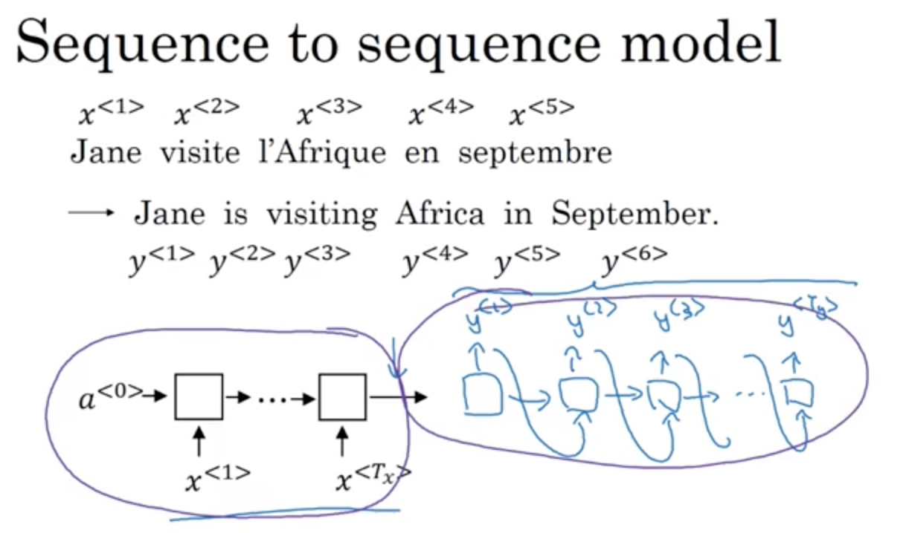

use AlexNet as encoder, cut the softmax and then use an encoder for captioning

language model: calculates probability of a sentence
can think of Language Model (LM) as a decoder network
with this in mind we can then say that Machine Translation (MT) is a decoder + LM
conditional language model e.g. P(English translation | French sentence)

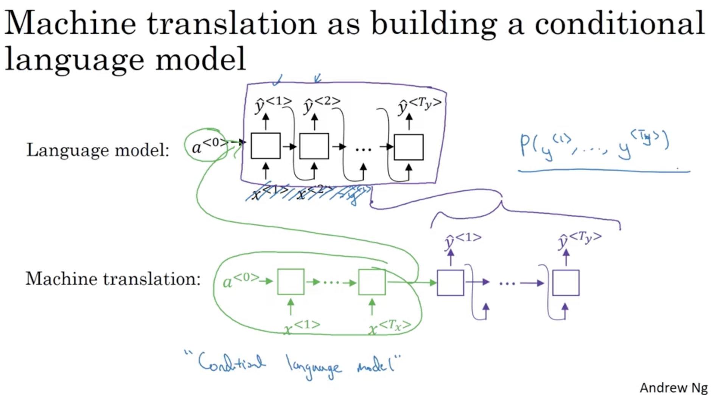

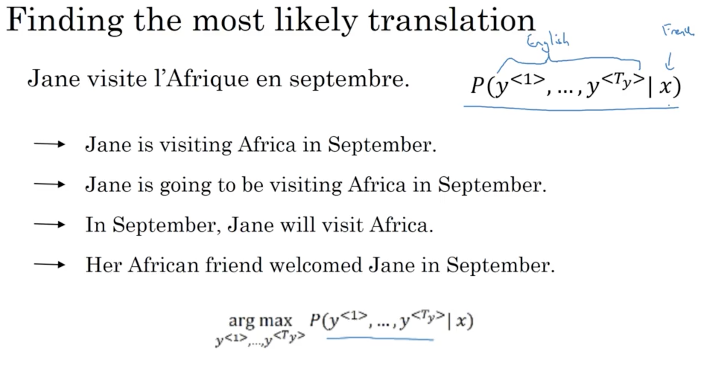

If we've started with
> Jane is ...

Then the next most likley greedy selection might be *going* and a better global sentence will be tossed in greedy search.
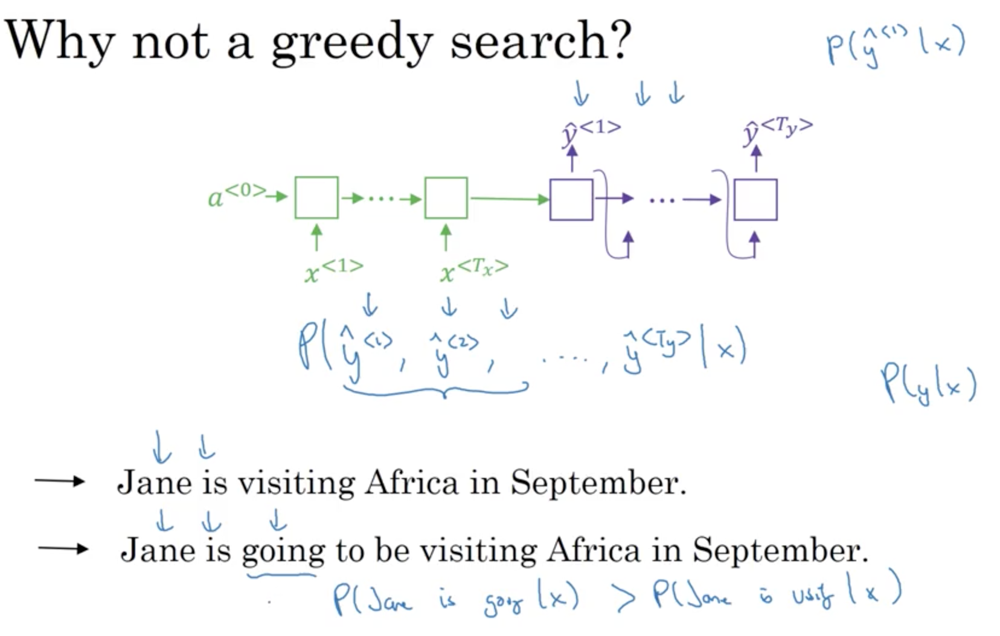

### Beam Search
Beam width = `B`
Beam width is the number of candidates considered
Let's say `B=3`
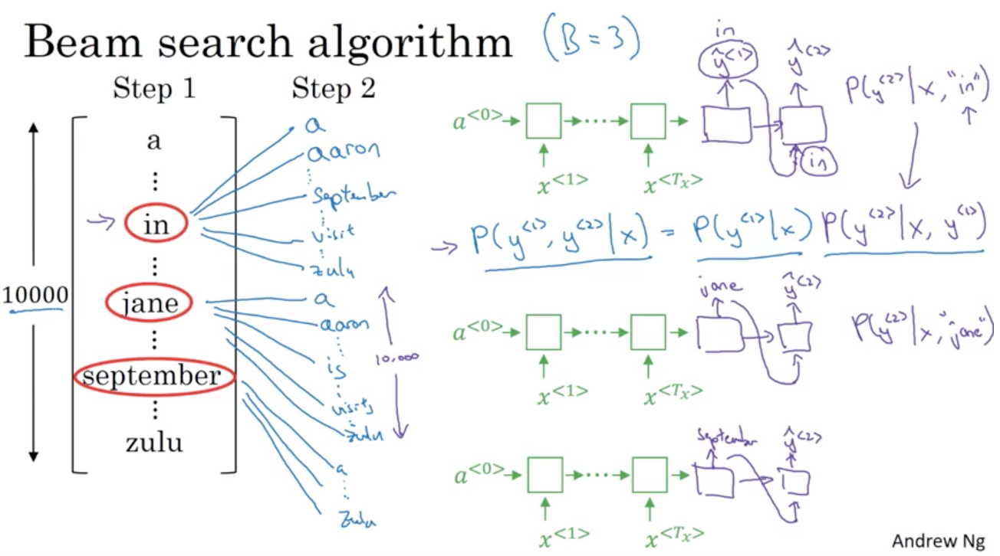

Instantiating 3 copies of the network in each step (i.e. one for each candidate).

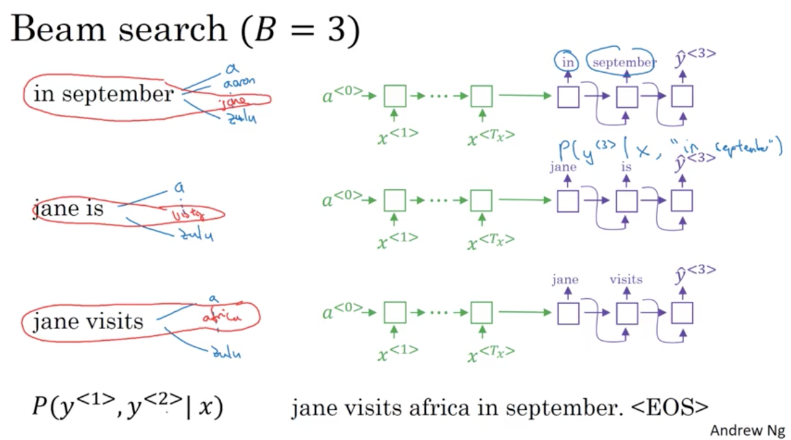

If `B=1` then beam search degenerates to greedy search

Multiplications can result in numerical underflow, maximizing the sum of log probabilities is the same.

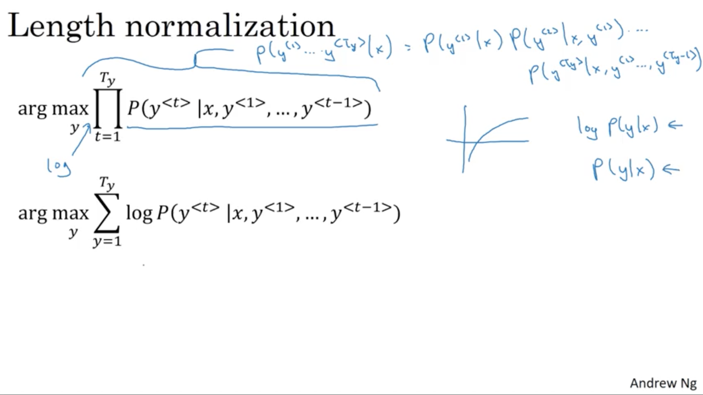

This objective function tends to prefer shorter sentences as there's less multiplications of less than 1 values.
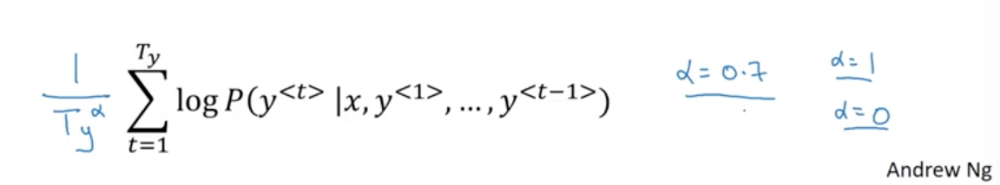

Normalized log-likelihood

How to choose beam width B? computational complexity vs. result quality. Beam width of 10 likely for production systems, 100-1,000 more common for research projects. There's diminishing returns to increasing B. Beam search is an approximate/heuristic algorithm unlike BFS or DFS so it's faster but not guaranteed to find the optimal answer.

#### Error analysis in beam search

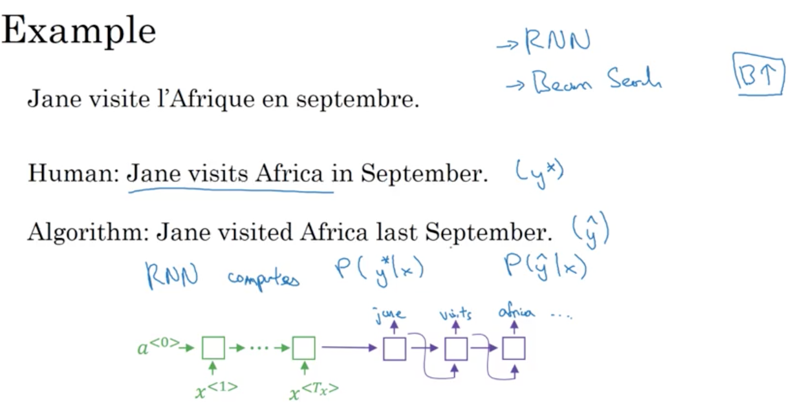

If most of error is attributed to beam search then it may be warranted to incerase `B`
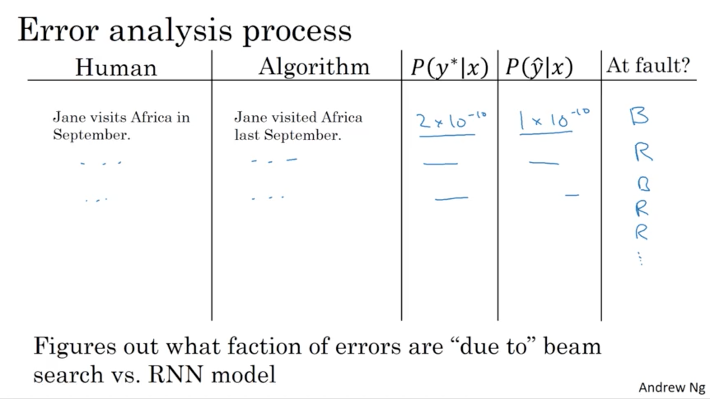

### Bleu score
Bleu score on unigrams
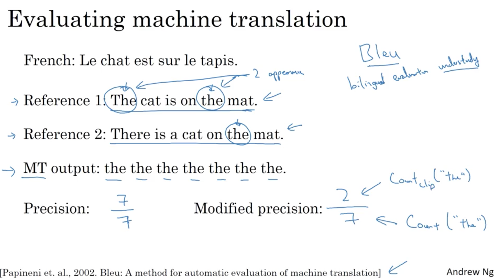

Bleu score on bigrams
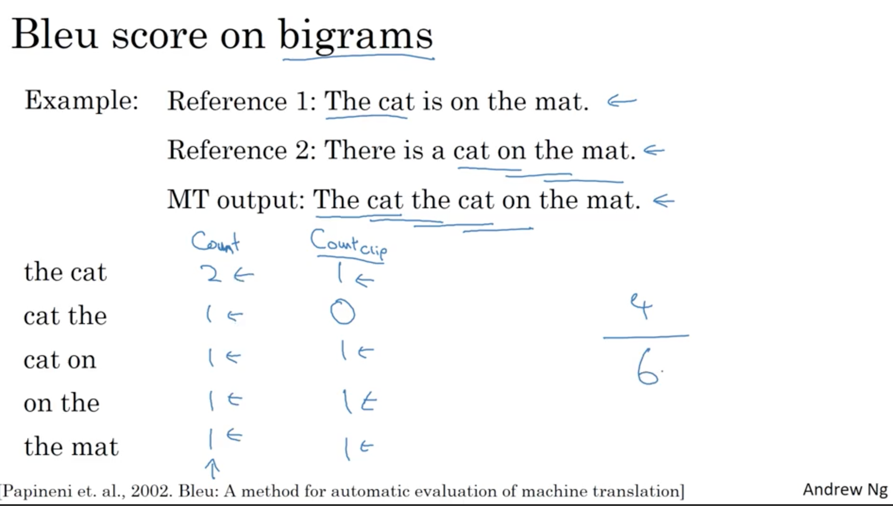

Bleu score on n-grams
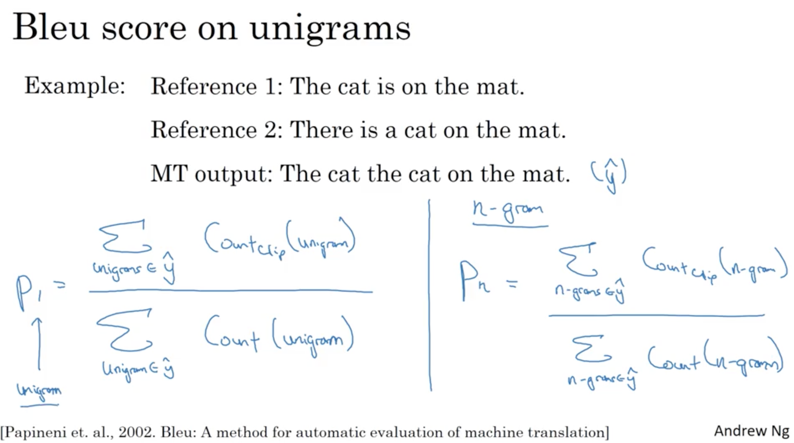

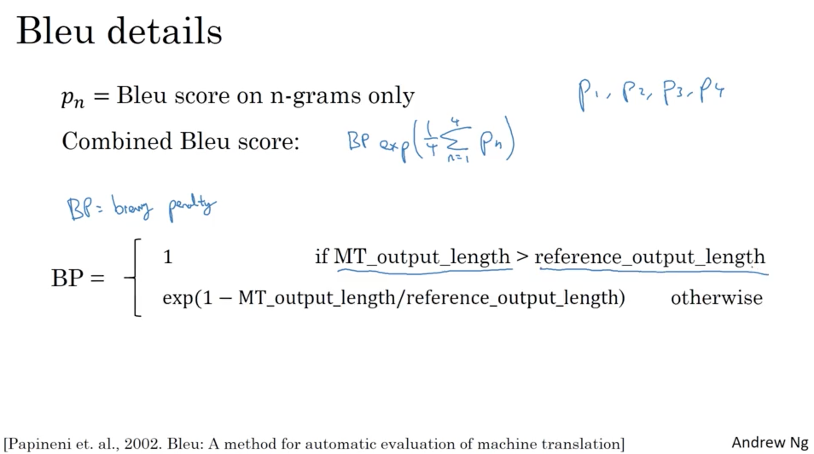

Image captioning and MT use bleu score

### Attention

Compute attention weights
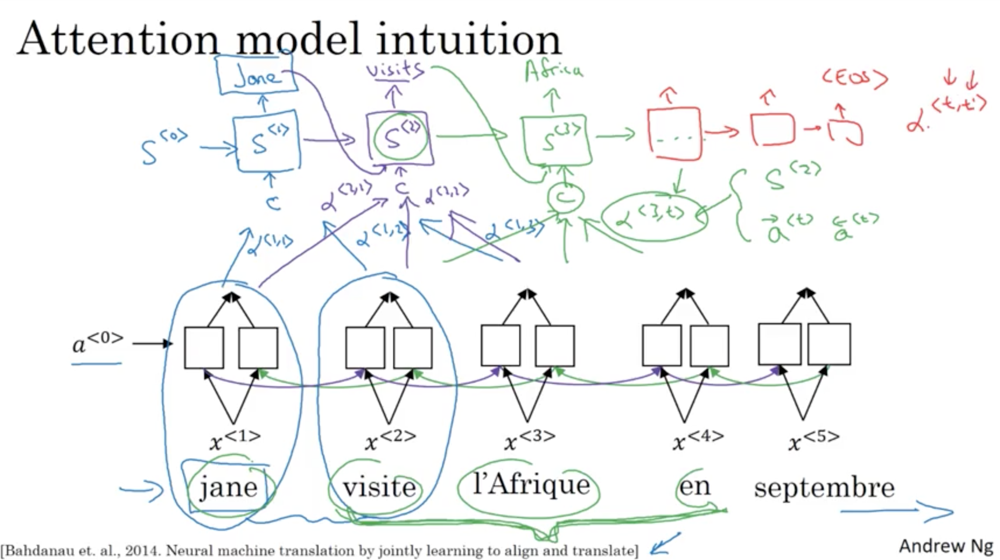

LSTMs used more commonly

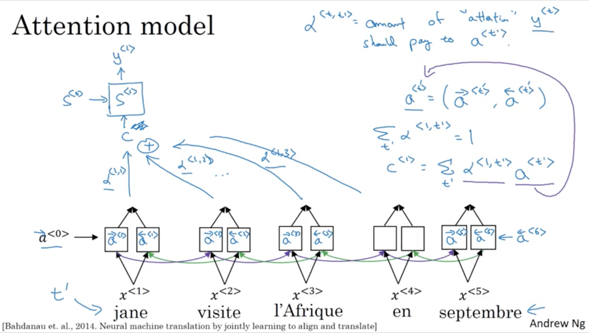

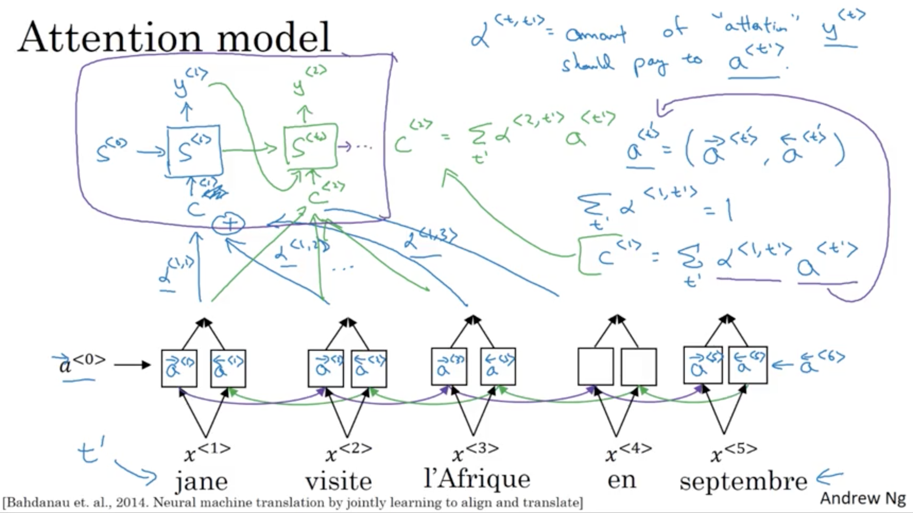

Calculating attention
Use softmax
$$S^{<t-1>}$$ is the hidden state from `t-1`

